_This was the final project for the Face and Gesture Analysis subject, which [Andreu Garcies](https://github.com/AndreuG01) and I developed at the [School of Engineering](https://www.upf.edu/web/etic/home) of [Universitat Pompeu Fabra](https://www.upf.edu/)._

## Introduction

For the final project of the Face and Gesture Analysis subject, we have developed a face recognition pipeline that performs well in identifying the ID of 80 famous people (see [Appendix A](#ids-of-the-80-famous-people) for a complete list of their identities). This report aims to explain the project's thinking and development process and highlight the project's evolution between previous labs of the subject and the final challenge.

## A Deep Learning based method

Since the first deep neural networks appeared in 2014, they have become state-of-the-art in solving many computer vision problems. This is also true for face recognition (FR), where networks such as DeepFace [@taigman2014deepface] and DeepID [@sun2014deep] have proved to achieve a similar or better performance than humans. The power of deep learning (DL) in face recognition lies in its ability to autonomously learn intricate patterns and features directly from raw data, enabling remarkably accurate and robust identification capabilities. Unlike traditional methods that rely on handcrafted features and explicit rules, deep learning models can automatically extract hierarchical representations of facial features, discerning complex patterns that may not be apparent to human observers.

Given the excellent performance of DL-based FR models and our prior (limited) experience with deep learning, we chose this methodology to solve the challenge.

## The pipeline

This section of the report will analyze each step of the face recognition pipeline we have developed. The process of taking an input image and returning a person's ID entails five steps: a face detector preprocessor, a face detector, a feature extractor preprocessor, a feature extractor, and a feature classifier (responsible for determining to which ID the extracted features correspond to). However, our approach combines the feature extractor and feature classification into a single neural network. [Figure 1](#pipeline_overview) shows a graphical representation of our implemented pipeline.

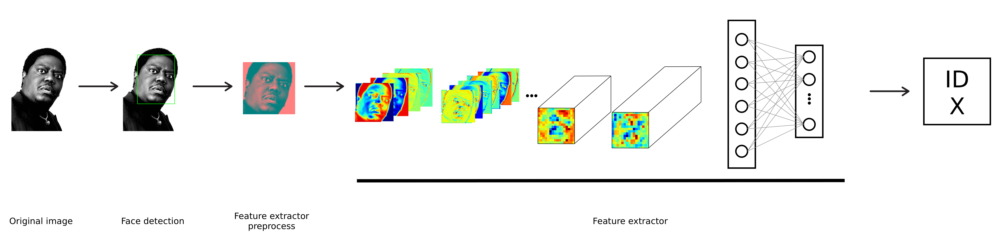

### Face detector preprocessor

This step is responsible for applying any image transformation the face detector requires. Currently, we only change gray-scale images to RGB images with three channels (to have a uniform image shape).

### Face detector

To correctly identify a face within an image, we first need to determine the location of the face, if it is present. As its name suggests, the face detector is responsible for detecting the coordinates within the image where a face is situated. In the first Lab on this subject, we implemented a satisfactory face detector based on the Viola and Jones algorithm [@viola2004robust]. However, a significant drawback of our face detector was its relatively high false negative rate (FNR) of almost 6\%. A high FNR indicates that the model could not detect multiple real faces. Losing real faces early in the pipeline poses a considerable obstacle for an accurate face recognition system, as faces that go undetected cannot be identified at all. Hence, we focused our efforts in this pipeline phase towards minimizing the FNR as much as possible.

#### MTCNN

We tested several face detectors to find the most suitable one for our pipeline: MediaPipe,[^1] YuNet [@wu2023yunet], RetinaFace with Resnet-50 backbone [@deng2020retinaface],[^2] and Multitask Cascaded Convolutional Networks (MTCNN) [@zhang2016joint].[^3] MTCNN was the one that produced better results, achieving a FNR of 1.23\% while preserving a good F1-score. Check [Appendix B](#comparison-of-face-detectors) for a detailed comparison.

[^1]: Open source project available at https://github.com/google/mediapipe.

[^2]: Python library code available at https://github.com/serengil/retinaface.

[^3]: We have used a PyTorch-compatible python implementation, available at https://github.com/timesler/facenet-pytorch.

It is important to mention that reducing the FNR comes with a set of trade-offs. An adverse outcome of this reduction is an increased false positive rate, or in other words, identifying human faces in images that lack them. Therefore, we need our feature extractor model to be robust enough to handle input images without faces (by classifying them with a low confidence for example).

### Feature extractor preprocessor

Once the detector has pinpointed the location and bounding box of a detected face, preprocessing is necessary to format it correctly for input into the feature extractor. As detailed in [Section 3.4](#feature-extractor), our feature extractor requires input images of size 128x128 with three color channels. The responsibility of converting the information provided by the face detector into a suitable image for the feature extractor lies with the feature extractor preprocessor. This preprocessor performs three primary functions:

1. Crop the original image around the generated bounding box, ensuring that the resulting crop is square and does not distort the face in any dimension.

2. Resize the square crop to match the 128x128 input size expected by the feature extractor (this may involve either upscaling or downscaling the image).

3. Adjust the color format of the image to the one expected by the feature extractor.

### Feature extractor

The feature extractor stands out as the most critical element of the pipeline. It aims to extract fundamental features of the facial images that it receives. Our DL-based feature extractor not only extracts these features but also performs the classification process to assign the corresponding ID to the input image.

Convolutional Neural Networks (CNNs) have shown remarkable performance at extracting facial features through their convolutional layers. CNNs use convolutional filters to scan through the input image, capturing local patterns and features at different spatial scales. The concatenation of different filter sizes produces a hierarchical feature extraction process that allows the network to capture complex patterns and attributes specific to faces.

State-of-the-art facial recognition networks contain an enormous number of parameters. For example, DeepFace surpasses 120 million parameters [@taigman2014deepface], illustrating the scale of complexity involved in these systems, especially for their training. Our feature extractor had to fulfill two main requirements: to _use a maximum of 1M of parameters_ and _include at most ten layers with trainable parameters_. Hence, the main focus at this project stage was to develop a lightweight CNN architecture capable of extracting meaningful and general enough facial features aligned with the imposed requirements.

#### Light CNN

The Light CNN network, [@wu2018light], has proved efficient in terms of computational cost and storage space, achieved by minimizing the parameter count. Additionally, it is a robust network in handling extensive noisy datasets during training, facilitated by a variant of the maxout activation, which their authors refer to as max-feature-map (MFM). Given these advantages, we considered this architecture a good baseline for our feature extractor.

One of the breakthroughs introduced by the authors of the Light CNN architecture is the **MFM activation function**. One of its main advantages is that it effectively handles noisy signals commonly found in large-scale datasets, ensuring that errors from these signals do not bias the learning process of the CNN. Unlike traditional activation functions such as Rectified Linear Unit (ReLU) or some of its variants such as Leaky Rectified Linear Units (LReLU) and Parametric Rectified Linear Units (PReLU), MFM principles are akin to lateral inhibition from neural science [@wu2018light], which occurs during visual processes (as it is the case of facial recognition). Moreover, MFM achieves that the inhibition from one neuron is parameter-free, ensuring robustness across diverse datasets without extensive dependency on training data.

[@wu2018light] proposed three different variants of the Light CNN architecture. Its second lightest version can be seen in [Table 5](#table-5). Note that despite being considered a light model, the number of parameters is way higher than the maximum of 1M parameters we were allowed to use.

#### Superlight CNN

To reduce the number of parameters of the Light CNN network, we have created what we have named as **Superlight CNN**. The main change of the new architecture is a reduction in the number of output channels of each convolutional layer. Furthermore, we have swapped the first two convolutional layers with two inception modules since we were allowed to use up to two branches in our model. Finally, we have also decided to train the model with images in LAB color format, which can help with discrepancies in illumination.

The layer with the highest parameter count is the last fully connected layer, responsible for classifying the extracted features into the different IDs. The original Light CNN network extracts 256 features for each input image. We opted to decrease this number to 133 (the highest value we could get without surpassing 1M total parameters), sacrificing some degree of generalization and classification capability but significantly reducing the parameter count.

In the end, we have a total 998,282 trainable parameters distributed among 10 layers (8 convolutional layers and 2 fully connected layers. See [Figure 8](#V4_model) for a detailed diagram of the Superlight CNN architecture.

#### Other attempts

We have tried several techniques intended to improve the performance of our Superlight CNN architecture.

One of the most promising techniques was the use of depth-wise separable convolutions, which reduce the number of parameters of convolutional layers while keeping a similar performance [@howard-2017]. A depth-wise separable convolution performs a regular convolution operation in two different steps: a **depth-wise** convolution, which captures spatial information independently for each input channel, and a **point-wise** convolution, applied after the depth-wise convolution, which performs a combination of the channels.

With the additional parameters we had to spare, we increased the number of output channels of each convolutional layer as much as we could. However, we saw a regression in performance, possibly because we had to remove some 1x1 convolution layers to comply with the restriction of 10 trainable layers at most.

Another modification was the introduction of normalization techniques: first, we tried batch normalization and then instance normalization. However, the transfer learning step was negatively affected by both techniques, probably because the dataset used for training the feature extractor and the dataset used for training the classifier were different.

## Training Methodology

The two steps of our pipeline that might require training are the face detector and the feature extractor + classifier. We were allowed to use a pre-trained model for the face detector but not for the feature extractor and classifier.

As we will explain in more detail in the following section, we decided it best to train our Superlight CNN model with two different datasets, one with more than the 80 IDs we need to classify for the challenge and another one with only those 80 IDs. To do so, we first trained the model with the first dataset, adjusting the last fully connected layer (responsible for classifying the input images) to have an output size equal to the number of classes of this dataset. Once training with the first dataset finished, we used transfer learning to keep the learned facial features, and we only retrained the last fully connected layer, this time with the second dataset and an output size of 80 IDs.

Here, we provide a summary of the hyperparameters used in PyTorch to train both models:

<ScrollableTable id="table-1">
  <caption>
    Training hyperparameters. The learning rate was progressively reduced with a
    learning rate scheduler.
  </caption>
  <thead>
    <tr>
      <th>Hyperparameter</th>
      <th>Value</th>
    </tr>
  </thead>
  <tbody>
    <tr>
      <td>Batch size</td>
      <td>$512$</td>
    </tr>
    <tr>
      <td>Number of epochs</td>
      <td>$15$ for dataset 1 and $200$ for dataset 2</td>
    </tr>
    <tr>
      <td>Loss function</td>
      <td>Cross-Entropy</td>
    </tr>
    <tr>
      <td>Initial learning rate</td>
      <td>$1e-3$</td>
    </tr>
    <tr>
      <td>Final learning rate</td>
      <td>$1e-5$ for dataset 1 and $1e-6$ for dataset 2</td>
    </tr>
    <tr>
      <td>Weight decay</td>
      <td>$0$</td>
    </tr>
    <tr>
      <td>Optimizer</td>
      <td>Adam with default values</td>
    </tr>
  </tbody>
</ScrollableTable>

## Datasets used

Deep learning-based methods rely on enormous amounts of data for effective learning and generalization. Large volumes of labeled samples enable these models to learn diverse and subtle representations, enhancing their ability to generalize well to unseen instances. [@wang2021deep] summarize the data with which state-of-the-art models have been trained. The models that used fewer images have seen around 200K images during training, corresponding to 10K different identities. This contrasts with the amount of data we had been provided with for the challenge, only 1200 images. Moreover, 700 of these images belonged to impostors, so we only had 500 effective images to train the model.

Training a DL model on these few samples would generate an extremely over-fitted model, unable to generalize in front of unseen data. For this reason, the first step to train a model is to **obtain more training data**.

Having a dataset of hundreds of thousands of images of only 80 different people is not a viable solution since finding more than a hundred images for each identity is already difficult. For this reason, we decided to use two different datasets:

1. An existing face recognition dataset with a vast number of images and IDs. We use this dataset to train the feature extractor component of the model.

2. An expansion of the original 1200 images we were given with more data from each of the 80 IDs. We use this dataset to train the classification component of the model.

### The CelebA dataset

The CelebFaces Attributes Dataset (CelebA, [@liu2015faceattributes]) contains 202,599 face images corresponding to 10,177 identities. The advantage of this dataset is that, despite containing many images, it can be considered small compared to other datasets used for larger FR architectures. One advantage of the reduced size is that the annotations are very precise. Given that the dataset was accessible and relatively easy to use, we decided to train the early versions of our models using the CelebA dataset.

### The VGGFace2 dataset

While the CelebA dataset was useful early in development, we had to stop training early to avoid over-fitting. In order to train the model for more epochs and improve its performance, using even more data could be beneficial. Ideally, we were looking for a dataset with more than 1M images. Even though over-parametrized deep learning models can achieve a good performance [@geiger2020scaling], under-parametrized models are often preferred. Otherwise, the training data could be theoretically fitted with zero loss. Therefore, having more data samples than model parameters ensures having an under-parametrized model. For this reason, we decided to use the VGGFace2 dataset, [@cao2018vggface2]. This dataset contains 3.31M images of 9131 subjects, with an average of 362.6 images for each subject.

### The expanded original dataset

With the CelebA and VGGFace2 datasets, we aimed to develop a robust facial feature extractor capable of capturing intricate facial details. However, to accurately identify the 80 required identities for the challenge, we still needed many images from those 80 IDs for the classifier to work correctly. Consequently, we decided to enrich the original dataset by incorporating additional data. This augmentation strategy involved two distinct approaches:

1. For Lab 4, our idea was to incorporate roughly 100 images for each ID. To do so, we used an automatic Google web scraper. Ultimately, we achieved a dataset with 6k images and 80 unique labels.

2. Based on the findings from Lab 4, we identified a potential deficiency in our model's generalization capacity. Consequently, we decided to augment the original dataset with even more additional data. On average, we added 100 new images per identity, which we manually downloaded from DuckDuckGo. Our selection process aimed to diversify the dataset by including images with varying poses and lighting conditions compared to our existing samples. The dataset grew to 15,265 images across 80 distinct labels with this expansion.

It is crucial to emphasize that these two steps entail acquiring the images and preprocessing and accurately labeling them. This ensures that the new dataset does not contain noisy labels.

## Results

Having explained the thinking and development process of the project, in this section we will now finally present the results that we have obtained.

### Training results of the Superlight CNN model trained with the VGG-Face2 dataset

The accuracy of the model when trained with the VGGFace2 dataset is $83.2 \%$. In [Figure 2](#v4_loss_acc_per_batch), [Figure 3](#v4_train_validation_accuracy), and [Figure 4](#v4_train_validation_loss) we plot the evolution of the training loss, the training accuracy, the validation loss, and the validation accuracy, respectiveley.

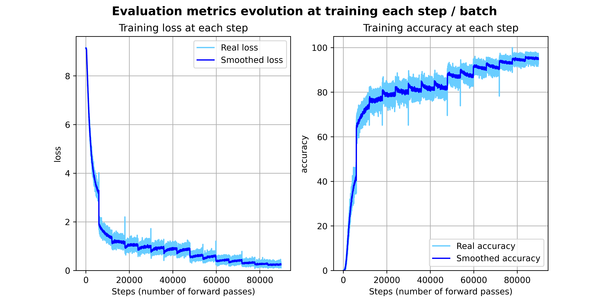

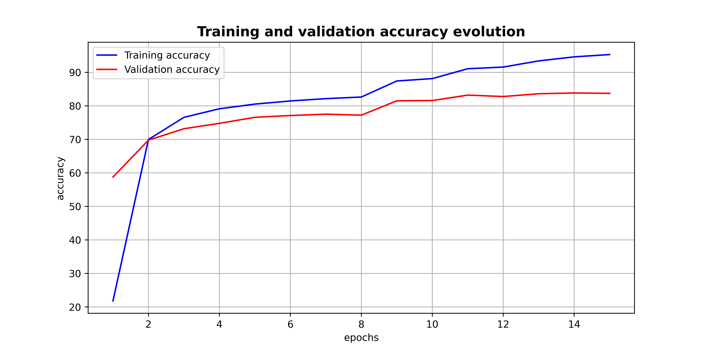

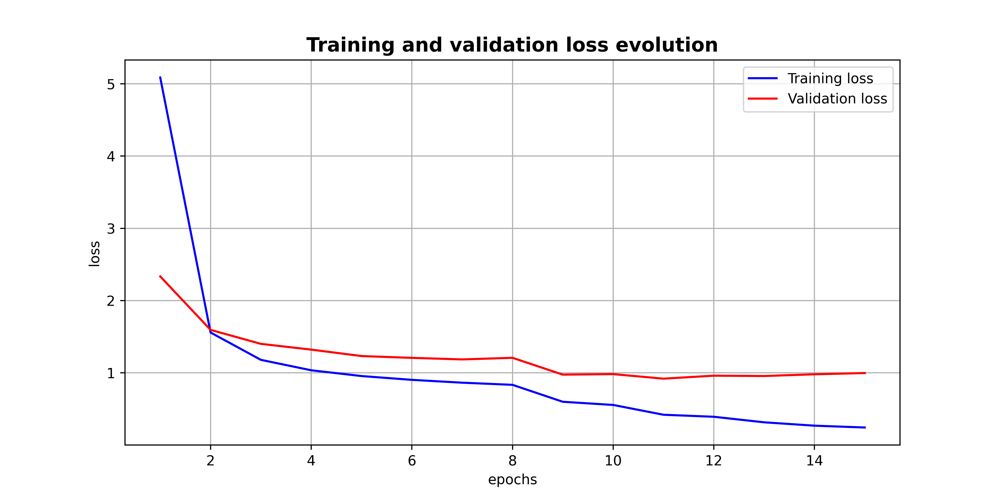

### Transfer learning results of the Superlight CNN model trained with the Expanded dataset

The accuracy of the model when trained with the expanded dataset that only contains the required 80 IDs is $75.62\%$. In [Figure 5](#tl_v4_loss_acc_per_batch), [Figure 6](#tl_v4_train_validation_accuracy), and [Figure 7](#tl_v4_train_validation_loss) we plot the evolution of the training loss, the training accuracy, the validation loss, and the validation accuracy, respectiveley.

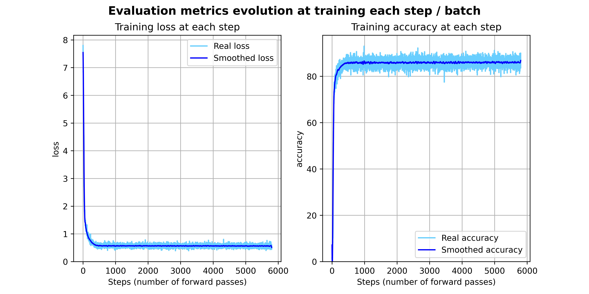

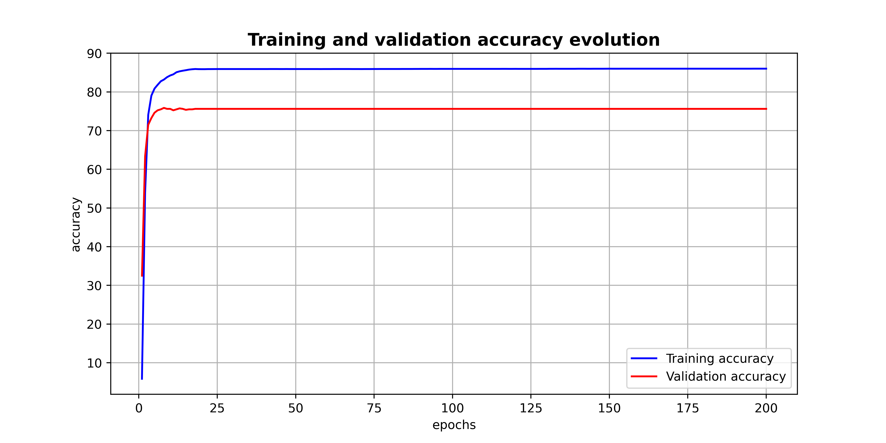

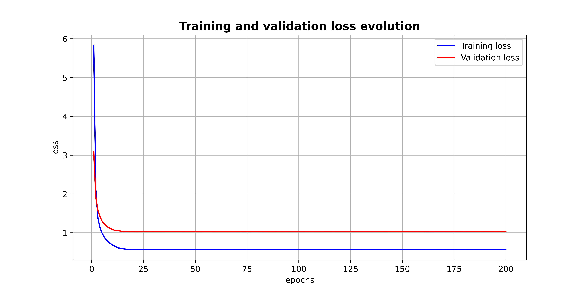

### Challenge results

Finally, the challenge results obtained with the original 1200 images are the following ones:

<ScrollableTable id="table-2">
  <caption>Challenge results.</caption>
  <thead>
    <tr>
      <th>F1-score</th>
      <th>Execution time (mm:ss)</th>
    </tr>
  </thead>
  <tbody>
    <tr>
      <td>$90.23 \%$</td>
      <td>00:50</td>
    </tr>
  </tbody>
</ScrollableTable>

The improvements implemented between Lab 4 and the final challenge have proven beneficial in terms of both model performance and generalization. These improvements have enabled us to continue training the model without excessively overfitting the training data. A comparison of the outcomes presented in [Table 2](#table-2) with those obtained in Lab 4, as depicted in [Appendix E](#training-results-of-lab-4), highlights the efficacy of these advancements.

## Future work

We will conclude this report with a brief mention of possible improvements and future work. First, we would have liked to try other architectures besides Light CNN. However, given the limited time frame, the fact that it already had good performance out of the box, and that it was close to satisfying most of our requirements, we decided to stick with it. Secondly, we could have dedicated more effort to handling noisy labels since we have read that it can help improve the training process and the model's performance. Finally, we could have incorporated alignment techniques into the feature extractor preprocessor, which could improve the results by $1$-$2 \%$.

## References

[^ref]

## Appendices

### IDs of the 80 famous people

<ScrollableTable id="table-3">
  <caption>List of Names with IDs.</caption>
  <thead>
    <tr>
      <th>ID</th>
      <th>Name</th>
      <th>ID</th>
      <th>Name</th>
      <th>ID</th>
      <th>Name</th>
    </tr>
  </thead>
  <tbody>
    <tr>
      <td>1</td>
      <td>Channing Tatum</td>
      <td>2</td>
      <td>Christina Applegate</td>
      <td>3</td>
      <td>Richard E. Grant</td>
    </tr>
    <tr>
      <td>4</td>
      <td>S. Epatha Merkerson</td>
      <td>5</td>
      <td>Farah Fath</td>
      <td>6</td>
      <td>Jim Beaver</td>
    </tr>
    <tr>
      <td>7</td>
      <td>Cheryl Hines</td>
      <td>8</td>
      <td>Michael Vartan</td>
      <td>9</td>
      <td>Hayden Christensen</td>
    </tr>
    <tr>
      <td>10</td>
      <td>Laurence Fishburne</td>
      <td>11</td>
      <td>Kathryn Joosten</td>
      <td>12</td>
      <td>Patrick Warburton</td>
    </tr>
    <tr>
      <td>13</td>
      <td>Jamie Lee Curtis</td>
      <td>14</td>
      <td>Jason Sudeikis</td>
      <td>15</td>
      <td>Billy Burke</td>
    </tr>
    <tr>
      <td>16</td>
      <td>Robert Pattinson</td>
      <td>17</td>
      <td>Melissa Claire Egan</td>
      <td>18</td>
      <td>Morena Baccarin</td>
    </tr>
    <tr>
      <td>19</td>
      <td>Jolene Blalock</td>
      <td>20</td>
      <td>Matthew Lillard</td>
      <td>21</td>
      <td>Alicia Goranson</td>
    </tr>
    <tr>
      <td>22</td>
      <td>Jennie Garth</td>
      <td>23</td>
      <td>Wanda De Jesus</td>
      <td>24</td>
      <td>Tracey E. Bregman</td>
    </tr>
    <tr>
      <td>25</td>
      <td>Tracey Gold</td>
      <td>26</td>
      <td>Brendan Fraser</td>
      <td>27</td>
      <td>Kellan Lutz</td>
    </tr>
    <tr>
      <td>28</td>
      <td>John Travolta</td>
      <td>29</td>
      <td>Pierce Brosnan</td>
      <td>30</td>
      <td>Jasmine Guy</td>
    </tr>
    <tr>
      <td>31</td>
      <td>Swoosie Kurtz</td>
      <td>32</td>
      <td>Diego Luna</td>
      <td>33</td>
      <td>Danny Glover</td>
    </tr>
    <tr>
      <td>34</td>
      <td>David Cross</td>
      <td>35</td>
      <td>Farrah Fawcett</td>
      <td>36</td>
      <td>Paul Walker</td>
    </tr>
    <tr>
      <td>37</td>
      <td>Matt Long</td>
      <td>38</td>
      <td>Andy García</td>
      <td>39</td>
      <td>Casey Affleck</td>
    </tr>
    <tr>
      <td>40</td>
      <td>Carla Gallo</td>
      <td>41</td>
      <td>James Brolin</td>
      <td>42</td>
      <td>Christian Bale</td>
    </tr>
    <tr>
      <td>43</td>
      <td>Nadia Bjorlin</td>
      <td>44</td>
      <td>Valerie Bertinelli</td>
      <td>45</td>
      <td>Alec Baldwin</td>
    </tr>
    <tr>
      <td>46</td>
      <td>Tamara Braun</td>
      <td>47</td>
      <td>Andy Serkis</td>
      <td>48</td>
      <td>Jackson Rathbone</td>
    </tr>
    <tr>
      <td>49</td>
      <td>Robert Redford</td>
      <td>50</td>
      <td>Julie Marie Berman</td>
      <td>51</td>
      <td>Chris Kattan</td>
    </tr>
    <tr>
      <td>52</td>
      <td>Benicio del Toro</td>
      <td>53</td>
      <td>Anthony Hopkins</td>
      <td>54</td>
      <td>Lea Michele</td>
    </tr>
    <tr>
      <td>55</td>
      <td>Jean-Claude Van Damme</td>
      <td>56</td>
      <td>Adrienne Frantz</td>
      <td>57</td>
      <td>Kim Fields</td>
    </tr>
    <tr>
      <td>58</td>
      <td>Wendie Malick</td>
      <td>59</td>
      <td>Lacey Chabert</td>
      <td>60</td>
      <td>Harry Connick Jr.</td>
    </tr>
    <tr>
      <td>61</td>
      <td>Cam Gigandet</td>
      <td>62</td>
      <td>Andrea Anders</td>
      <td>63</td>
      <td>Chris Noth</td>
    </tr>
    <tr>
      <td>64</td>
      <td>Cary Elwes</td>
      <td>65</td>
      <td>Aisha Hinds</td>
      <td>66</td>
      <td>Chris Rock</td>
    </tr>
    <tr>
      <td>67</td>
      <td>Neve Campbell</td>
      <td>68</td>
      <td>Susan Dey</td>
      <td>69</td>
      <td>Robert Duvall</td>
    </tr>
    <tr>
      <td>70</td>
      <td>Caroline Dhavernas</td>
      <td>71</td>
      <td>Marilu Henner</td>
      <td>72</td>
      <td>Christian Slater</td>
    </tr>
    <tr>
      <td>73</td>
      <td>Kris Kristofferson</td>
      <td>74</td>
      <td>Shelley Long</td>
      <td>75</td>
      <td>Alan Arkin</td>
    </tr>
    <tr>
      <td>76</td>
      <td>Faith Ford</td>
      <td>77</td>
      <td>Jason Bateman</td>
      <td>78</td>
      <td>Edi Gathegi</td>
    </tr>
    <tr>
      <td>79</td>
      <td>Emile Hirsch</td>
      <td>80</td>
      <td>Joaquin Phoenix</td>
      <td></td>
      <td></td>
    </tr>
  </tbody>
</ScrollableTable>

### Comparison of face detectors

<ScrollableTable id="table-4">
  <caption>
    F1-score and false negative rate (FNR) of different face detectors.
  </caption>
  <thead>
    <tr>
      <th>Method</th>
      <th>F1-score</th>
      <th>FNR</th>
      <th>Execution time (mm:ss)</th>
    </tr>
  </thead>
  <tbody>
    <tr>
      <td>Viola-Jones + MediaPipe (Lab 1)</td>
      <td>$88.50 \%$</td>
      <td>$5.97 \%$</td>
      <td>03:07</td>
    </tr>
    <tr>
      <td>MediaPipe</td>
      <td>$66.13 \%$</td>
      <td>$5.06 \%$</td>
      <td>00:03</td>
    </tr>
    <tr>
      <td>MTCNN</td>
      <td>$73.42 \%$</td>
      <td>$1.23 \%$</td>
      <td>01:52</td>
    </tr>
    <tr>
      <td>RetinaFace Resnet-50</td>
      <td>$68.32 \%$</td>
      <td>$1.53 \%$</td>
      <td>16:49</td>
    </tr>
    <tr>
      <td>YuNet (OpenCV implementation)</td>
      <td>$72.55 \%$</td>
      <td>$4.13 \%$</td>
      <td>00:26</td>
    </tr>
  </tbody>
</ScrollableTable>

### LightCNN network structure

<ScrollableTable id="table-5">
  <caption>
    Architecture of the LightCNN network with 9 layers, taken from
    [@wu2018light].
  </caption>
  <thead>
    <tr>
      <th>Type</th>
      <th>Filter Size/Stride, Pad</th>
      <th>Output Size</th>
      <th>#Params</th>
    </tr>
  </thead>
  <tbody>
    <tr>
      <td>Conv1</td>
      <td>5 × 5/1, 2</td>
      <td>128 × 128 × 96</td>
      <td>2.4 K</td>
    </tr>
    <tr style="border-bottom: 1px solid var(--md-sys-color-on-surface-variant)">
      <td>MFM1</td>
      <td>-</td>
      <td>128 × 128 × 48</td>
      <td>-</td>
    </tr>
    <tr style="border-bottom: 1px solid var(--md-sys-color-on-surface-variant)">
      <td>Pool1</td>
      <td>2 × 2/2</td>
      <td>64 × 64 × 48</td>
      <td>-</td>
    </tr>
    <tr>
      <td>Conv2a</td>
      <td>1 × 1/1</td>
      <td>64 × 64 × 96</td>
      <td>4.6 K</td>
    </tr>
    <tr>
      <td>MFM2a</td>
      <td>-</td>
      <td>64 × 64 × 48</td>
      <td>-</td>
    </tr>
    <tr>
      <td>Conv2</td>
      <td>3 × 3/1, 1</td>
      <td>64 × 64 × 192</td>
      <td>165 K</td>
    </tr>
    <tr style="border-bottom: 1px solid var(--md-sys-color-on-surface-variant)">
      <td>MFM2</td>
      <td>-</td>
      <td>64 × 64 × 96</td>
      <td>-</td>
    </tr>
    <tr style="border-bottom: 1px solid var(--md-sys-color-on-surface-variant)">
      <td>Pool2</td>
      <td>2 × 2/2</td>
      <td>32 × 32 × 96</td>
      <td>-</td>
    </tr>
    <tr>
      <td>Conv3a</td>
      <td>1 × 1/1</td>
      <td>32 × 32 × 192</td>
      <td>18 K</td>
    </tr>
    <tr>
      <td>MFM3a</td>
      <td>-</td>
      <td>32 × 32 × 96</td>
      <td>-</td>
    </tr>
    <tr>
      <td>Conv3</td>
      <td>3 × 3/1, 1</td>
      <td>32 × 32 × 384</td>
      <td>331 K</td>
    </tr>
    <tr style="border-bottom: 1px solid var(--md-sys-color-on-surface-variant)">
      <td>MFM3</td>
      <td>-</td>
      <td>32 × 32 × 192</td>
      <td>-</td>
    </tr>
    <tr style="border-bottom: 1px solid var(--md-sys-color-on-surface-variant)">
      <td>Pool3</td>
      <td>2 × 2/2</td>
      <td>16 × 16 × 192</td>
      <td>-</td>
    </tr>
    <tr>
      <td>Conv4a</td>
      <td>1 × 1/1</td>
      <td>16 × 16 × 384</td>
      <td>73 K</td>
    </tr>
    <tr>
      <td>MFM4a</td>
      <td>-</td>
      <td>16 × 16 × 192</td>
      <td>-</td>
    </tr>
    <tr>
      <td>Conv4</td>
      <td>3 × 3/1, 1</td>
      <td>16 × 16 × 256</td>
      <td>442 K</td>
    </tr>
    <tr style="border-bottom: 1px solid var(--md-sys-color-on-surface-variant)">
      <td>MFM4</td>
      <td>-</td>
      <td>16 × 16 × 128</td>
      <td>-</td>
    </tr>
    <tr>
      <td>Conv5a</td>
      <td>1 × 1/1</td>
      <td>16 × 16 × 256</td>
      <td>32 K</td>
    </tr>
    <tr>
      <td>MFM5a</td>
      <td>-</td>
      <td>16 × 16 × 128</td>
      <td>-</td>
    </tr>
    <tr>
      <td>Conv5</td>
      <td>3 × 3/1, 1</td>
      <td>16 × 16 × 256</td>
      <td>294 K</td>
    </tr>
    <tr style="border-bottom: 1px solid var(--md-sys-color-on-surface-variant)">
      <td>MFM5</td>
      <td>-</td>
      <td>16 × 16 × 128</td>
      <td>-</td>
    </tr>
    <tr style="border-bottom: 1px solid var(--md-sys-color-on-surface-variant)">
      <td>Pool4</td>
      <td>2 × 2/2</td>
      <td>8 × 8 × 128</td>
      <td>-</td>
    </tr>
    <tr>
      <td>fc1</td>
      <td>-</td>
      <td>512</td>
      <td>4.1M</td>
    </tr>
    <tr style="border-bottom: 1px solid var(--md-sys-color-on-surface-variant)">
      <td>MFM_fc1</td>
      <td>-</td>
      <td>256</td>
      <td>-</td>
    </tr>
  </tbody>
  <tfoot>
    <th>Total</th>
    <td>-</td>
    <td>-</td>
    <td>5.5 M</td>
  </tfoot>
</ScrollableTable>

### SuperlightCNN network diagram

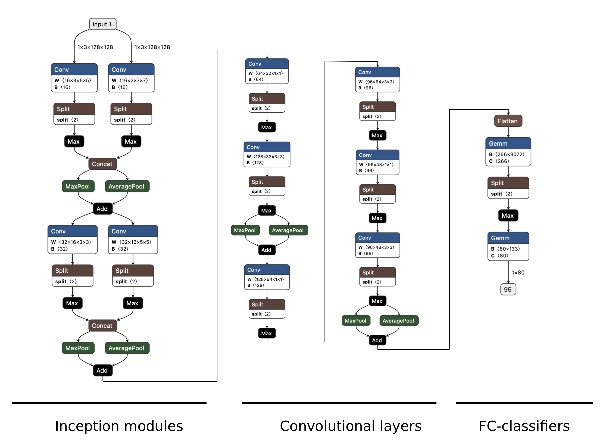

### Training results of Lab 4

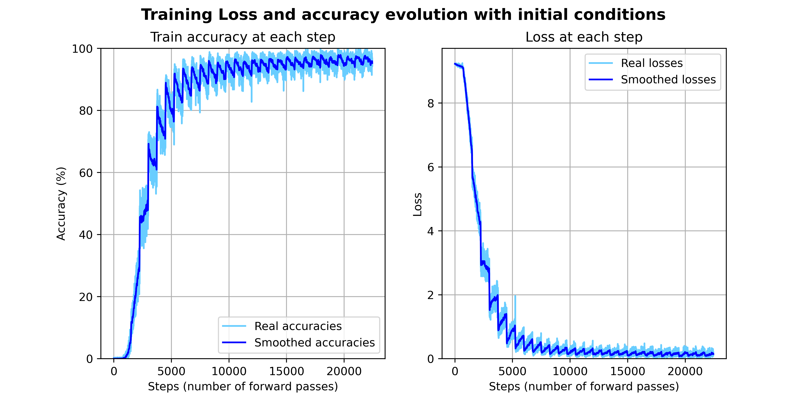

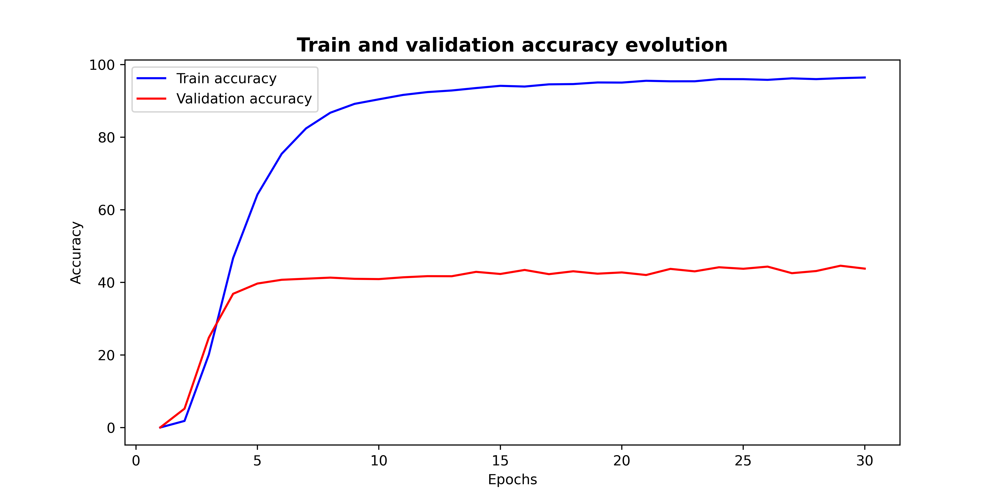

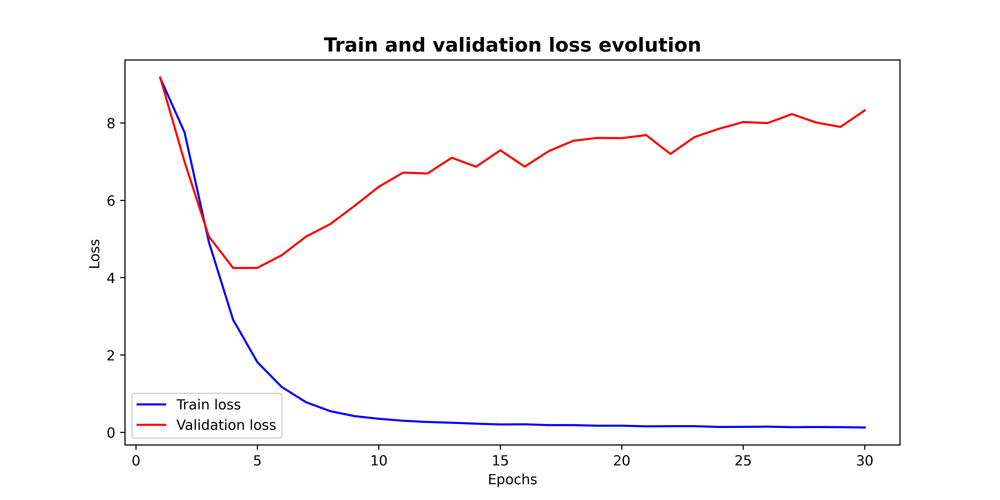
